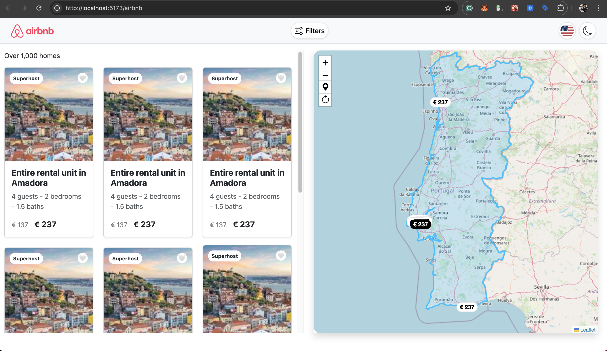

# airbnb
Building a website like Airbnb in React

# Commands

````

npx create-vite@latest . -- --template react

Select a framework: React
Select a variant: TypeScript
Use rolldown-vite (Experimental)?: No
Install with npm and start now? Yes

npm i -S react-router-dom
npm i -D gh-pages

npm i -S leaflet
npm i -S leaflet-draw
npm i -S react-leaflet@next
npm i -S react-leaflet-cluster
npm i -S react-leaflet-draw

npm i -D prettier eslint-plugin-prettier eslint-config-prettier @typescript-eslint/eslint-plugin @typescript-eslint/parser eslint-plugin-react

npm i -S flag-icons
npm i -D @types/aos

Setup package.json

  "scripts": {
    "dev": "vite",
    "build": "tsc -b && vite build",
    "preview": "vite preview",
    "lint": "eslint 'src/**/*.{ts,tsx}'",
    "lint:fix": "eslint 'src/**/*.{ts,tsx}' --fix",
    "format": "prettier --write 'src/**/*.{ts,tsx,js,jsx,json,css,scss,md}'",
    "deploy": "gh-pages -d dist"
  },

Copy files from other project
.env
eslint.config.js
.prettierrc
.prettierignore

-- UI
npm i -S aos bootstrap bootstrap-icons reactstrap

-- Deploy
npm run predeploy
npm run deploy

php -S localhost:8080

````

## Web Interface

http://localhost:3000



## Demo

https://devrazec.github.io/airbnb